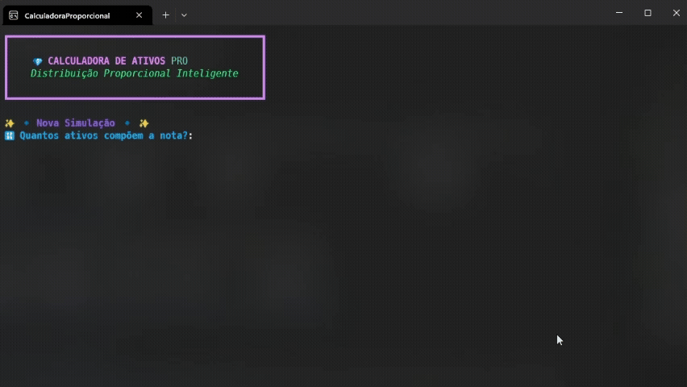

# :gem: Calculadora de Ativos PRO

[](https://www.python.org/) [](https://github.com/Igor-Scalzer010/Calculadora-de-Ativos/releases/latest)    

> :bar_chart: **Distribuição Proporcional Inteligente** - Calcule automaticamente a distribuição proporcional de custos entre ativos com uma interface moderna e elegante no terminal.

---
<div align="center">

</div>


## :bookmark_tabs: Índice

- [:sparkles: Características](#sparkles-características)
- [:dart: O que o programa faz?](#dart-o-que-o-programa-faz)
- [:wrench: Pré-requisitos](#wrench-pré-requisitos)
- [:package: Instalação](#package-instalação)
- [:rocket: Uso](#rocket-uso)
- [:bulb: Exemplo Prático](#bulb-exemplo-prático)
- [:art: Fontes Recomendadas](#art-fontes-recomendadas)
- [:triangular_ruler: Como Funciona o Cálculo](docs/CALCULO.md)
- [:memo: Estrutura do Projeto](#memo-estrutura-do-projeto)

---

## :sparkles: Características

- :art: **Interface moderna** com [Rich](https://github.com/Textualize/rich) - cores, emojis e tabelas elegantes
- :brazil: **Formato brasileiro** - entrada e saída de valores em formato BRL
- :zap: **Cálculo automático** - distribuição proporcional inteligente de custos
- :arrows_counterclockwise: **Processamento em lote** - calcule múltiplas notas em sequência
- :bar_chart: **Relatórios detalhados** - visualize custos por ativo em tabelas formatadas diretamente no terminal

---

## :dart: O que o programa faz?

A **Calculadora de Ativos PRO** resolve um problema comum no mercado financeiro: **distribuir proporcionalmente os custos de uma operação entre múltiplos ativos**.

### Cenário Hipotético:

Você comprou 4 ativos diferentes em uma única nota de corretagem:

- **Ativo A**: R\$ $1.500,00$
- **Ativo B**: R\$ $2.500,00$
- **Ativo C**: R\$ $3.000,00$
- **Ativo D**: R\$ $1.000,00$

**Total investido**: R\$ $8.000,00$  
**Valor da nota (com os custos de liquidação)**: R\$ $8.250,00$  
**Custo total**: R\$ $250,00$

:question: **Como distribuir esses R\$ $250,00$ de custo proporcionalmente entre os 4 ativos?**

:white_check_mark: **Este programa faz isso automaticamente!**

---

## :wrench: Pré-requisitos

### Sistema Operacional
-  
-  
-  

### Python
- :snake: **Python 3.8 ou superior**
- :package: **pip** (gerenciador de pacotes Python)

### Terminal
Para a melhor experiência visual (com emojis e formatação), use um dos seguintes terminais:
- **Windows Terminal** (Windows 10/11)
- **PowerShell 7+**
- **CMD** com suporte a Unicode

---

## :package: Instalação

### :one: Execute no 

1. Faça o download do arquivo `CalculadoraDeAtivosPRO_[versão]_win_x64.exe`: [](https://github.com/Igor-Scalzer010/Calculadora-de-Ativos/releases/latest)
2. Abra o terminal (**Windows Terminal ou PowerShell**)
3. Navegue até a pasta onde o arquivo `.exe` foi salvo
4. Execute o programa:

```bash
.\CalculadoraDeAtivosPRO_[versão]_win_x64.exe
```

5. Outra forma de executar é dando um **duplo clique** no arquivo `.exe`.

### :two: Clone ou baixe o projeto

```bash
git clone https://github.com/Igor-Scalzer010/Calculadora-de-Ativos.git
cd Calculadora-de-Ativos
```

### :three: Instale as dependências

```bash
pip install rich
```

**Ou usando requirements.txt:**

```bash
pip install -r requirements.txt
```

### :four: Execute o programa

```bash
python src/main.py
```

---

## :rocket: Uso

### Execução Básica

```bash
cd src
python main.py
```

### Fluxo de Uso

1. :memo: **Informe a quantidade de ativos** na nota
2. :label: **Digite o nome/ticker** de cada ativo (ex: PETR4, VALE3, etc)
3. :pencil2: **Informe o tipo de operação** para cada ativo (Compra ou Venda)
4. :moneybag: **Informe o valor** de cada ativo (sem o custo de aquisição)
5. :receipt: **Digite o valor total da nota** (com todos os custos incluídos)
6. :zap: **Veja o resultado** em uma tabela formatada
7. :arrows_counterclockwise: **Processe outra nota** ou saia
### Formato de Entrada

:white_check_mark: Formato **correto** para entrada de valores:
- `1500` | `1500,00` | `1.500,00`

:x: Formato **incorreto** para entrada de valores:
- `R$ 1.500,00` (não inclua R$)
- `1,500.00` (formato americano não suportado)

---

## :bulb: Exemplo Prático

### Entrada de Dados

```
🔢 Quantos ativos compõem a nota?: 4

➤ Ativo #1
  🏷️  Nome/Ticker: PETR4
  🖍️  Tipo de Operação (o padrão é Compra) [C/V]: C
  💲  Valor Financeiro (sem os custos/taxas) (PETR4): 1.500,00

➤ Ativo #2
  🏷️  Nome/Ticker: VALE3
  🖍️  Tipo de Operação (o padrão é Compra) [C/V]: C
  💲  Valor Financeiro (sem os custos/taxas) (VALE3): 2500,00

➤ Ativo #3
  🏷️  Nome/Ticker: ITUB4
  🖍️  Tipo de Operação (o padrão é Compra) [C/V]: C
  💲  Valor Financeiro (sem os custos/taxas) (ITUB4): 3.000

➤ Ativo #4
  🏷️  Nome/Ticker: BBAS3
  🖍️  Tipo de Operação (o padrão é Compra) [C/V]: C
  💲  Valor Financeiro (sem os custos/taxas) (BBAS3): 1000

🧾 Valor Líquido da Nota (Total Liquidação): 8.250,00
```

### Saída - Relatório de Custos

| :label: Nome/Ticker | :dollar: Valor Inicial | :chart_with_downwards_trend: Custo (+) | :moneybag: Valor Final (=) |
|:-------------------:|:----------------------:|:--------------------------------------:|:--------------------------:|
| PETR4               | R$ 1.500,00            | R$ 46,88                               | R$ 1.546,88                |
| VALE3               | R$ 2.500,00            | R$ 78,12                               | R$ 2.578,12                |
| ITUB4               | R$ 3.000,00            | R$ 93,75                               | R$ 3.093,75                |
| BBAS3               | R$ 1.000,00            | R$ 31,25                               | R$ 1.031,25                |

### Tabela Resumo do Exemplo

| Ativo  | Valor Original | Proporção | Custo Calculado | Valor Final |
|--------|----------------|-----------|-----------------|-------------|
| PETR4  | R$ 1.500,00    | 18,75%    | R$ 46,88        | R$ 1.546,88 |
| VALE3  | R$ 2.500,00    | 31,25%    | R$ 78,12        | R$ 2.578,12 |
| ITUB4  | R$ 3.000,00    | 37,50%    | R$ 93,75        | R$ 3.093,75 |
| BBAS3  | R$ 1.000,00    | 12,50%    | R$ 31,25        | R$ 1.031,25 |
| **TOTAL** | **R$ 8.000,00** | **100%** | **R$ 250,00** | **R$ 8.250,00** |

---

## :art: Fontes Recomendadas

Para a **melhor experiência visual** com emojis e caracteres especiais, instale uma das seguintes fontes no seu terminal:

### :star: Recomendadas (com suporte completo a emojis)

| Fonte | Download | Características |
|-------|----------|-----------------|
| **Cascadia Code** | [GitHub](https://github.com/microsoft/cascadia-code) | :white_check_mark: Fonte oficial do Windows Terminal, suporte nativo a emojis |
| **MesloLGM Nerd Font** | [Nerd Fonts](https://www.nerdfonts.com/) | :white_check_mark: Excelente renderização, ícones incluídos |
| **JetBrains Mono** | [JetBrains](https://www.jetbrains.com/lp/mono/) | :white_check_mark: Ótima legibilidade, suporte a ligaduras |
| **Consolas** | Incluída no Windows | :warning: Suporte limitado a emojis |

### :memo: Como Configurar a Fonte no Windows Terminal

1. Abra o **Windows Terminal**
2. Pressione `Ctrl + ,` para abrir as configurações
3. Vá em **Perfis → Padrões → Aparência**
4. Em **Tipo de fonte**, selecione uma das fontes recomendadas
5. Salve e reinicie o terminal

### :wrench: Configuração via JSON (Windows Terminal)

```json
{
    "profiles": {
        "defaults": {
            "font": {
                "face": "Cascadia Code",
                "size": 11
            }
        }
    }
}
```

### :warning: Problemas com os Emojis?

Se os emojis não aparecerem corretamente:

1. :white_check_mark: Verifique se a fonte suporta emojis
2. :white_check_mark: Use o **Windows Terminal** (melhor suporte)
3. :white_check_mark: Certifique-se de que o console está configurado para UTF-8
4. :white_check_mark: Atualize o Windows para a versão mais recente

---

## :memo: Estrutura do Projeto

```
calculo_proporcional_acoes/
│
├── 📁 src/
│   ├── main.py                 # Script principal
│   └── 📁 utils/
│       ├── calcula.py          # Lógica do cálculo proporcional
│       ├── formatters.py       # Formatação de valores BRL
│       └── prompts.py          # Prompts customizados
│
├── 📁 scripts/
│   └── generate_chart.py       # Gerador de gráficos SVG com Plotly
│
├── 📁 tests/
│   └── test_calcula.py         # Testes unitários
│
├── 📁 docs/
│   └── CALCULO.md              # Documentação detalhada dos cálculos
│
├── 📁 data/
│   └── demo_data.json          # Dados de demonstração para gerar gráficos
│
├── 📁 assets/
│   ├── demo.gif                # GIF de demonstração
│   └── graph.svg               # Gráfico gerado (output)
│
├── README.md                    # Esta documentação
└── .gitignore                   
```

---

<div align="center">

**:gem: Calculadora de Ativos PRO** © 2026

Desenvolvido com :heart: e :coffee:

Distribuição Proporcional Inteligente

</div>
