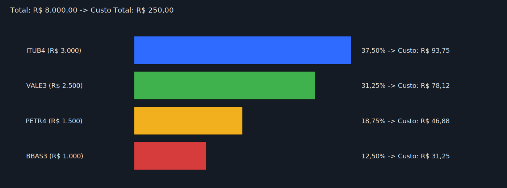

# :triangular_ruler: Como Funciona o Cálculo?

## Fórmula de Distribuição Proporcional

Para cada ativo `i`:

$$
\text{Proporção}(i) = \frac{\text{Valor}(i)}{\text{Valor Total dos Ativos}}
$$

$$
\text{Custo}(i) = (\text{Nota Total com Custos} - \text{Valor Total dos Ativos}) \times \text{Proporção}(i)
$$

$$
\text{Valor Final}(i) = \text{Valor}(i) + \text{Custo}(i)
$$

## Exemplo de Cálculo Detalhado

**Dados:**
- Valor PETR4: R\$ $1.500,00$
- Valor VALE3: R\$ $2.500,00$
- Valor ITUB4: R\$ $3.000,00$
- Valor BBAS3: R\$ $1.000,00$
- **Soma**: R\$ $8.000,00$
- **Nota Total**: R\$ $8.250,00$
- **Custo Total**: R\$ $250,00$

### Cálculo para PETR4:

1. **Proporção**: $\frac{1.500,00}{8.000,00} = 0,1875$ (18,75%)
2. **Custo**: $250,00 \times 0,1875 = 46,88$ → R$ 46,88
3. **Valor Final**: $1.500,00 + 46,88 = 1.546,88$ → **R$ 1.546,88**

### Cálculo para VALE3:

1. **Proporção**: $\frac{2.500,00}{8.000,00} = 0,3125$ (31,25%)
2. **Custo**: $250,00 \times 0,3125 = 78,12$ → R$ 78,12
3. **Valor Final**: $2.500,00 + 78,12 = 2.578,12$ → **R$ 2.578,12**
### Cálculo para ITUB4:

1. **Proporção**: $\frac{3.000,00}{8.000,00} = 0,3750$ (37,50%)
2. **Custo**: $250,00 \times 0,3750 = 93,75$ → R$ 93,75
3. **Valor Final**: $3.000,00 + 93,75 = 3.093,75$ → **R$ 3.093,75**

### Cálculo para BBAS3:

1. **Proporção**: $\frac{1.000,00}{8.000,00} = 0,1250$ (12,50%)
2. **Custo**: $250,00 \times 0,1250 = 31,25$ → R$ 31,25
3. **Valor Final**: $1.000,00 + 31,25 = 1.031,25$ → **R$ 1.031,25**

## Verificação

:white_check_mark: **Soma dos custos**: $46,88 + 78,12 + 93,75 + 31,25 = 250,00$ → R$ 250,00  
:white_check_mark: **Soma dos valores finais**: $1.546,88 + 2.578,12 + 3.093,75 + 1.031,25 = 8.250,00$ → R$ 8.250,00

> :information_source: Pequenas diferenças de centavos podem ocorrer devido ao arredondamento.

## Explicação Matemática

A distribuição proporcional garante que cada ativo receba uma parte do custo total **proporcional ao seu valor** em relação ao total investido.

### Por que usar distribuição proporcional?

Imagine que você pagou:
- R\$ $3.000,00$ em uma determinada ação
- R\$ $1.000,00$ em outra ação

Se dividíssemos os custos igualmente, o ativo barato teria um custo percentual muito maior, distorcendo seu preço médio. A distribuição proporcional resolve isso, mantendo a proporção justa.

### Exemplo Visual

[:back: Voltar para o README](../README.md)
