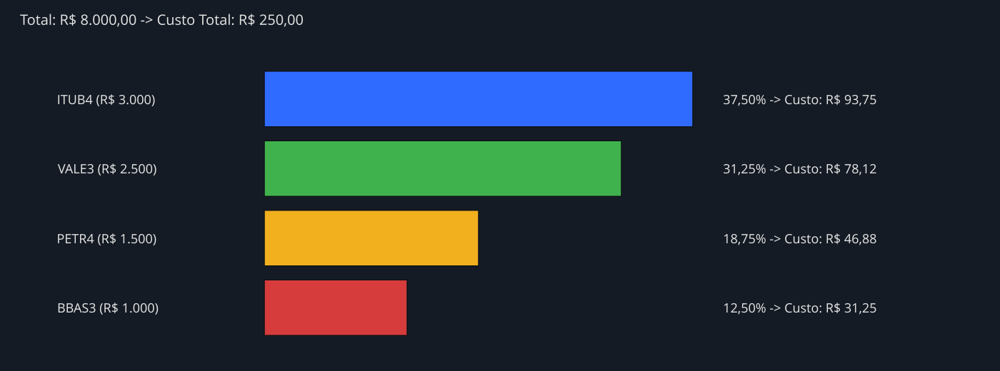

# :triangular_ruler: Como Funciona o Cálculo?

## Fórmula de Distribuição Proporcional

### Para Operações de Compra (C)

Para cada ativo `i`:

$$
\text{Proporção}(i) = \frac{\text{Valor}(i)}{\text{Valor Total Financeiro}}
$$

$$
\text{Custo}(i) = \text{Custo Total} \times \text{Proporção}(i)
$$

$$
\text{Valor Final}(i) = \text{Valor}(i) + \text{Custo}(i)
$$

### Para Operações de Venda (V)

Para cada ativo `i`:

$$
\text{Proporção}(i) = \frac{\text{Valor}(i)}{\text{Valor Total Financeiro}}
$$

$$
\text{Custo}(i) = \text{Custo Total} \times \text{Proporção}(i)
$$

$$
\text{Valor Final}(i) = \text{Valor}(i) - \text{Custo}(i)
$$

> :information_source: **Nota**: Na compra, o custo é adicionado ao valor de aquisição. Na venda, o custo é subtraído do valor recebido (reduz o lucro líquido).

> :information_source: O **Valor Total Financeiro** é a soma absoluta dos valores (sem os custos) de todas as operações (compras e vendas) na nota de corretagem.

## Exemplo de Cálculo Detalhado

### Exemplo :one:: Apenas Operações de Compra

**Dados:**
- Valor PETR4 (Compra): R\$ $1.500,00$
- Valor VALE3 (Compra): R\$ $2.500,00$
- Valor ITUB4 (Compra): R\$ $3.000,00$
- Valor BBAS3 (Compra): R\$ $1.000,00$
- **Valor Total**: R\$ $8.000,00$
- **Saldo Teórico**: R\$ $-8.000,00$ (saída de dinheiro)
- **Nota Líquida**: R\$ $-8.250,00$
- **Custo Total**: R\$ $250,00$

### Cálculo para PETR4:

1. **Proporção**: $\frac{1.500,00}{8.000,00} = 0,1875$ (18,75%)
2. **Custo**: $250,00 \times 0,1875 = 46,88$ → R\$ $46,88$
3. **Valor Final**: $1.500,00 + 46,88 = 1.546,88$ → **R\$ $1.546,88$**

### Cálculo para VALE3:

1. **Proporção**: $\frac{2.500,00}{8.000,00} = 0,3125$ (31,25%)
2. **Custo**: $250,00 \times 0,3125 = 78,12$ → R\$ $78,12$
3. **Valor Final**: $2.500,00 + 78,12 = 2.578,12$ → **R\$ $2.578,12$**
### Cálculo para ITUB4:

1. **Proporção**: $\frac{3.000,00}{8.000,00} = 0,3750$ (37,50%)
2. **Custo**: $250,00 \times 0,3750 = 93,75$ → R\$ $93,75$
3. **Valor Final**: $3.000,00 + 93,75 = 3.093,75$ → **R\$ $3.093,75$**

### Cálculo para BBAS3:

1. **Proporção**: $\frac{1.000,00}{8.000,00} = 0,1250$ (12,50%)
2. **Custo**: $250,00 \times 0,1250 = 31,25$ → R\$ $31,25$
3. **Valor Final**: $1.000,00 + 31,25 = 1.031,25$ → **R\$ $1.031,25$**

## Verificação

:white_check_mark: **Soma dos custos**: $46,88 + 78,12 + 93,75 + 31,25 = 250,00$ → R\$ $250,00$  
:white_check_mark: **Soma dos valores finais**: $1.546,88 + 2.578,12 + 3.093,75 + 1.031,25 = 8.250,00$ → R\$ $8.250,00$

> :information_source: Pequenas diferenças de centavos podem ocorrer devido ao arredondamento.

## Explicação Matemática

A distribuição proporcional garante que cada ativo receba uma parte do custo total **proporcional ao seu valor** em relação ao total investido.

### Por que usar distribuição proporcional?

Imagine que você pagou:
- R\$ $3.000,00$ em uma determinada ação
- R\$ $1.000,00$ em outra ação

Se dividíssemos os custos igualmente, ou seja, 50% para cada ativo, o ativo mais barato teria um custo percentual muito maior, distorcendo seu preço médio. A distribuição proporcional resolve isso, mantendo a proporção justa.

### Exemplo Visual

---

## Exemplo :two:: Operações Mistas (Compra e Venda)

**Cenário:**  
Você possui operações de compra e venda na mesma nota de corretagem.

**Dados:**
- PETR4 (Compra): R\$ $3.500,00$
- VALE3 (Venda): R\$ $2.000,00$
- ITUB4 (Compra): R\$ $1.500,00$
- **Valor Total Financeiro**: R\$ $7.000,00$ (soma absoluta)
- **Saldo Teórico das Operações**: R\$ $-3.000,00$
- **Nota Líquida**: R\$ $-3.150,00$ (você pagou R$ 3.150,00 após os custos)
- **Custo Total**: R\$ $150,00$

> :information_source: O **Saldo teórico das operações** é a compra (subtração) mais a venda (adição), sem considerar custos. 

### Cálculo para PETR4 (Compra):

1. **Proporção**: $\frac{3.500,00}{7.000,00} = 0,5000$ (50,00%)
2. **Custo**: $150,00 \times 0,5000 = 75,00$ → R\$ $75,00$
3. **Valor Final**: $3.500,00 + 75,00 = 3.575,00$ → **R\$ $3.575,00$**

### Cálculo para VALE3 (Venda):

1. **Proporção**: $\frac{2.000,00}{7.000,00} = 0,2857$ (28,57%)
2. **Custo**: $150,00 \times 0,2857 = 42,86$ → R\$ $42,86$
3. **Valor Final**: $2.000,00 - 42,86 = 1.957,14$ → **R\$ $1.957,14$** (você recebeu)

### Cálculo para ITUB4 (Compra):

1. **Proporção**: $\frac{1.500,00}{7.000,00} = 0,2143$ (21,43%)
2. **Custo**: $150,00 \times 0,2143 = 32,14$ → R\$ $32,14$
3. **Valor Final**: $1.500,00 + 32,14 = 1.532,14$ → **R\$ $1.532,14$**

### Verificação:

:white_check_mark: **Soma dos custos**: $75,00 + 42,86 + 32,14 = 150,00$ → R\$ $150,00$  
:white_check_mark: **Valor final** (com os custos): $-3.575,00 + 1.957,14 - 1.532,14 = -3.150,00$ → R\$ $-3.150,00$

### Tabela Resumo - Operações Mistas

| :label: Nome/Ticker | :pencil2: Operação | :dollar: Valor Bruto | :bar_chart: Proporção | :chart_with_downwards_trend: Custo | :moneybag: Valor Final |
| :-----------------: | :----------------: | :------------------: | :-------------------: | :--------------------------------: | :--------------------: |
|        PETR4        |       Compra       |     R\$ 3.500,00     |        50,00%         |             +R\$ 75,00             |      R\$ 3.575,00      |
|        VALE3        |       Venda        |     R\$ 2.000,00     |        28,57%         |             -R\$ 42,86             |      R\$ 1.957,14      |
|        ITUB4        |       Compra       |     R\$ 1.500,00     |        21,43%         |             +R\$ 32,14             |      R\$ 1.532,14      |
|      **TOTAL**      |         -          |   **R\$ 7.000,00**   |       **100%**        |           **R\$ 150,00**           |   **-R\$ 3.150,00**    |

> :bulb: **Interpretação**: Na compra, os custos aumentam o preço de aquisição. Na venda, os custos reduzem o valor recebido (lucro líquido).

[:back: Voltar para o README](../README.md)
